---
## Front matter
title: "Отчёт по лабораторной работе 2"
subtitle: "архитектура компьютеров"
author: "Царев Максим Александрович"

## Generic otions
lang: ru-RU
toc-title: "Содержание"

## Bibliography
bibliography: bib/cite.bib
csl: pandoc/csl/gost-r-7-0-5-2008-numeric.csl

## Pdf output format
toc: true # Table of contents
toc-depth: 2
lof: true # List of figures
lot: true # List of tables
fontsize: 12pt
linestretch: 1.5
papersize: a4
documentclass: scrreprt
## I18n polyglossia
polyglossia-lang:
  name: russian
  options:
	- spelling=modern
	- babelshorthands=true
polyglossia-otherlangs:
  name: english
## I18n babel
babel-lang: russian
babel-otherlangs: english
## Fonts
mainfont: IBM Plex Serif
romanfont: IBM Plex Serif
sansfont: IBM Plex Sans
monofont: IBM Plex Mono
mathfont: STIX Two Math
mainfontoptions: Ligatures=Common,Ligatures=TeX,Scale=0.94
romanfontoptions: Ligatures=Common,Ligatures=TeX,Scale=0.94
sansfontoptions: Ligatures=Common,Ligatures=TeX,Scale=MatchLowercase,Scale=0.94
monofontoptions: Scale=MatchLowercase,Scale=0.94,FakeStretch=0.9
mathfontoptions:
## Biblatex
biblatex: true
biblio-style: "gost-numeric"
biblatexoptions:
  - parentracker=true
  - backend=biber
  - hyperref=auto
  - language=auto
  - autolang=other*
  - citestyle=gost-numeric
## Pandoc-crossref LaTeX customization
figureTitle: "Рис."
tableTitle: "Таблица"
listingTitle: "Листинг"
lofTitle: "Список иллюстраций"
lotTitle: "Список таблиц"
lolTitle: "Листинги"
## Misc options
indent: true
header-includes:
  - \usepackage{indentfirst}
  - \usepackage{float} # keep figures where there are in the text
  - \floatplacement{figure}{H} # keep figures where there are in the text
---

# Цель работы

Целью работы является изучить идеологию и применение средств контроля версий. Приобрести практические навыки по работе с системой git.

# Выполнение лабораторной работы

2.4.1 Настройка GitHub

1) Создал учётную запись на GitHub.

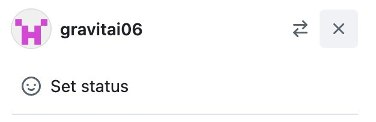{#fig:001 width=70%}

2.4.2 Базовая настройка GitHub

Открываю виртуальную машину и делаю предварительную конфигурацию git. Ввожу первую команду
для ввода своего имени, далее ввожу 2-ую команду для указанию почты владельца.

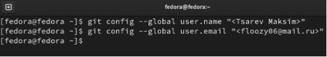{#fig:002 width=70%}

Настроиваю utf-8 в выводе сообщений git.

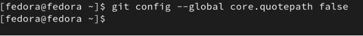{#fig:003 width=70%}

Настроиваю utf-8 в выводе сообщений git.

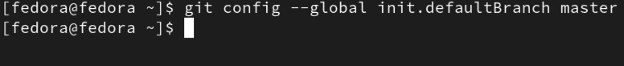{#fig:004 width=70%}

Задаю параметр autocrlf со значением input, так как я работаю в системе Linux, чтобы конвертировать CRLF в LF только при коммитах.

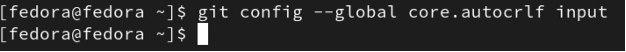{#fig:005 width=70%}

Задаю параметр safecrlf со значением warn, Git будет проверять преобразование на обратимость.

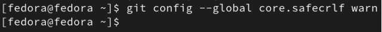{#fig:006 width=70%}

2.4.3 Cоздание SSH-ключа

Для идентификации на сервере репозиториев необходимо сгенерировать пару ключей (приватный и открытый).

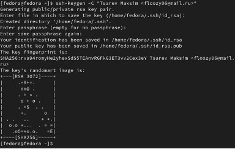{#fig:007 width=70%}

Xclip – утилита, позволяющая скопировать текст через терминал. Устанавливаю xclip с
помощью команды apt-get install с ключом -y.

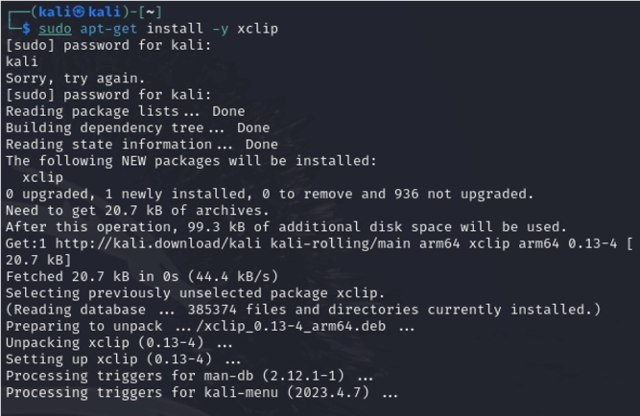{#fig:008 width=70%}

Копирую ключ из директории с помощью утилиты xclip.

{#fig:009 width=70%}

Открываю сайт GitHub, открываю свой профиль и выбираю страницу «SSH and GPG keys». Нажимаю кнопку «New SSH key».
 
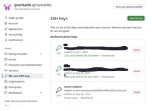{#fig:010 width=70%}

Вставляю скопированный ключ в поле «Key». В поле Title указываю имя для ключа. Нажимаю «Add SSH-key», чтобы завершить добавление ключа. И во вкладке мы видим новый SSH-key

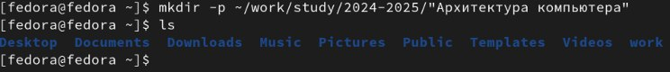{#fig:011 width=70%}

2.4.4 Создание рабочего пространства и репозитория курса на основе шаблона.

Открываю терминал создаю директорию, рабочее пространство, с помощью утилиты mkdir, блягодаря ключу -p создаю все директории после домашней ~/work/study/2024-2025/"Архитектура компьютера". Далее проверяю с помощью ls, действительно ли были созданы необходимые мне каталоги.

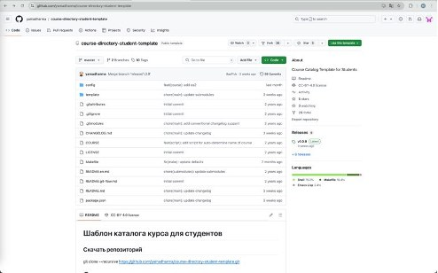{#fig:012 width=70%}

В браузере перехожу на страницу репозитория с шаблоном курса по адресу https://github.com/yamadharma/course-directory-student-template. Далее выбираю «Use this template», чтобы использовать этот шаблон для своего репозитория.

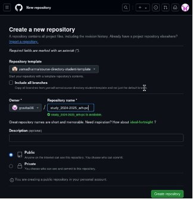{#fig:013 width=70%}

В открывшемся окне задаю имя репозитория (Repository name): study_2024–2025_arh-pc и создаю репозиторий, нажимаю на кнопку «Create repository»

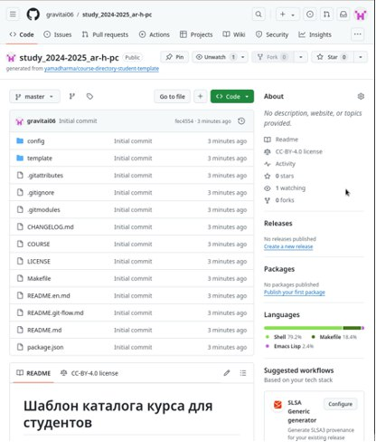{#fig:014 width=70%}

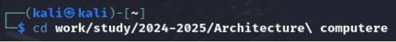{#fig:015 width=70%}

Репозиторий создан.

Через терминал перехожу в созданный каталог курса с помощью утилиты cd

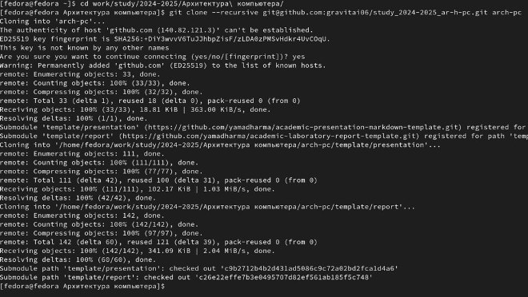{#fig:016 width=70%}

Копирую ссылку для клонирования на странице созданного репозитория, сначала перейдя в окно «code», далее выбрав в окне вкладку «SSH». Клонирую созданный репозиторий с помощью команды git clone –recursive.

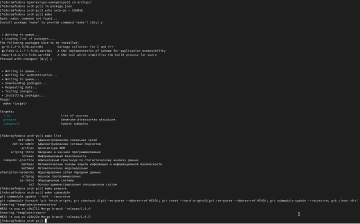{#fig:017 width=70%}

Перехожу в каталог arch-pc с помощью утилиты cd. Удаляю лишние файлы с помощью утилиты rm. Создаю нужные каталоги.

Отправляю созданные каталоги с локального репозитория на сервер: добавляю все созданные каталоги с помощью git add, комментирую и сохраняю изменения на сервере как добавлениекурса с помощью git commit.

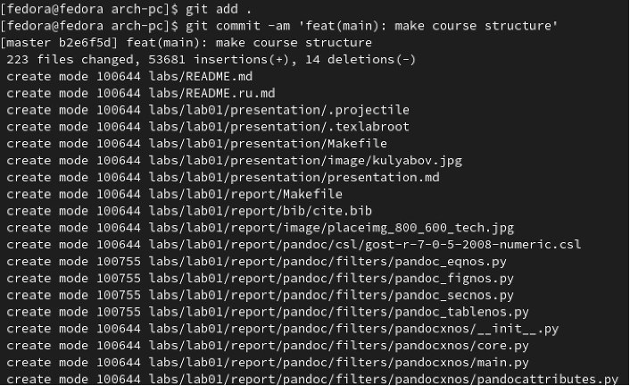{#fig:018 width=70%}

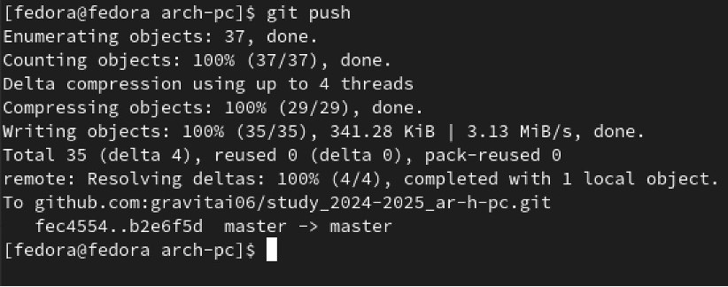{#fig:019 width=70%}

Отправляю все на сервер с помощью push. Проверяю правильность выполнения работы сначала на самом сайте GitHub.

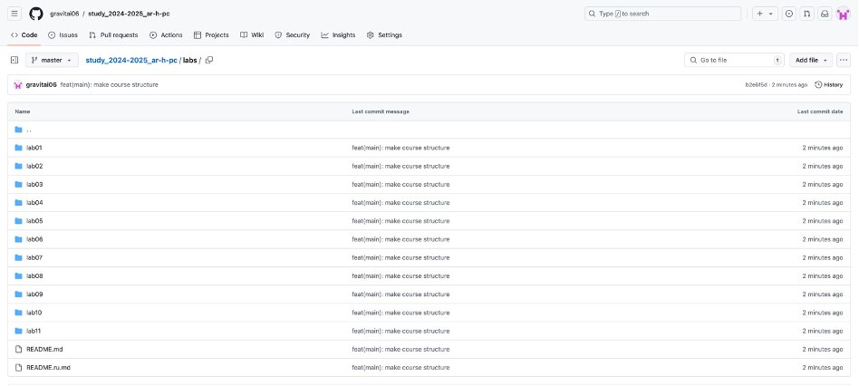{#fig:020 width=70%}

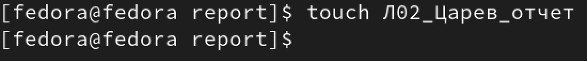{#fig:021 width=70%}

Задания для самостоятельной работы
1) Перехожу в директорию labs/lab02/report с помощью утилиты cd. Создаю в каталоге файл для отчета по третьей лабораторной работе с помощью утилиты touch.

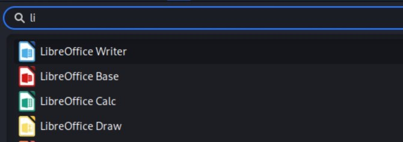{#fig:022 width=70%}

2) Оформлять отчет я буду в текстовом процессоре LibreOffice Writer, найдя его в меню приложений.

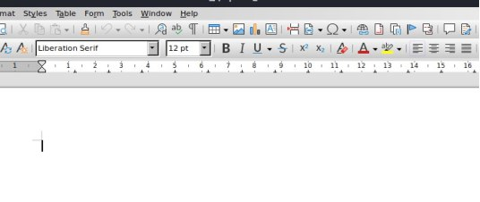{#fig:023 width=70%}

3) После открытия текстового редактора открываю в нем созданный файл и начинаю в нем работу над отчетом.

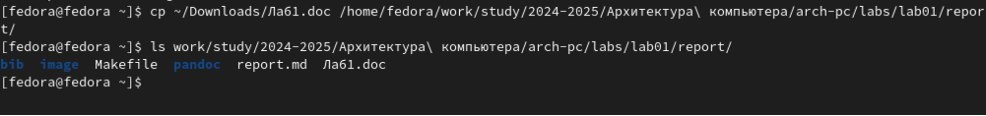{#fig:024 width=70%}

4) Копирую предыдущий отчет в папку lab01, и проверяю наличие.

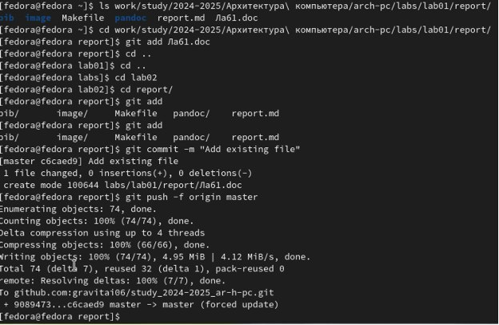{#fig:025 width=70%}

5) Добавляю с помощью git add, после делаю комменты с помощью git commit -m, и пушу в репозиторий.

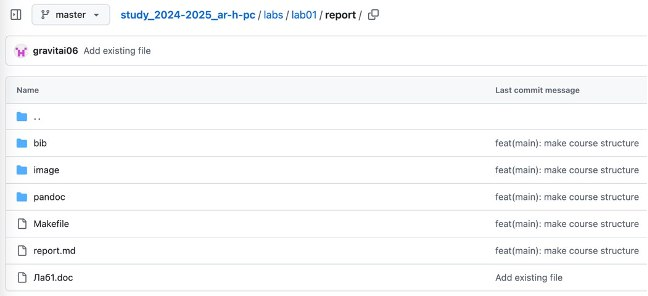{#fig:026 width=70%}

6)Проверяю на GitHub наличие лабораторных.

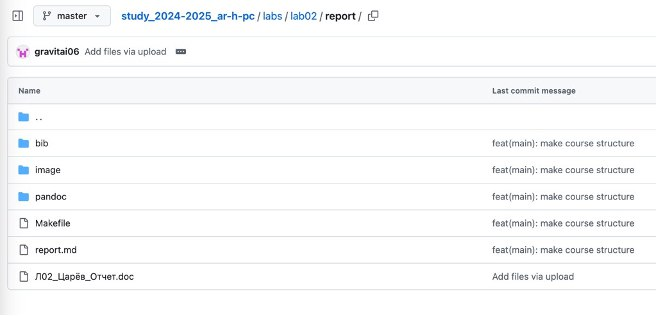{#fig:027 width=70%}

# Выводы

При выполнении лабораторной работы я изучил идеологию и применение средств контроля версий, а также приобрел практические навыки по работе с системой git.

