---
## Front matter
title: "Отчёт по лабораторной работе 3"
subtitle: "Архитектура компьютеров"
author: "Царев Максим Александрович"

## Generic otions
lang: ru-RU
toc-title: "Содержание"

## Bibliography
bibliography: bib/cite.bib
csl: pandoc/csl/gost-r-7-0-5-2008-numeric.csl

## Pdf output format
toc: true # Table of contents
toc-depth: 2
lof: true # List of figures
lot: true # List of tables
fontsize: 12pt
linestretch: 1.5
papersize: a4
documentclass: scrreprt
## I18n polyglossia
polyglossia-lang:
  name: russian
  options:
	- spelling=modern
	- babelshorthands=true
polyglossia-otherlangs:
  name: english
## I18n babel
babel-lang: russian
babel-otherlangs: english
## Fonts
mainfont: IBM Plex Serif
romanfont: IBM Plex Serif
sansfont: IBM Plex Sans
monofont: IBM Plex Mono
mathfont: STIX Two Math
mainfontoptions: Ligatures=Common,Ligatures=TeX,Scale=0.94
romanfontoptions: Ligatures=Common,Ligatures=TeX,Scale=0.94
sansfontoptions: Ligatures=Common,Ligatures=TeX,Scale=MatchLowercase,Scale=0.94
monofontoptions: Scale=MatchLowercase,Scale=0.94,FakeStretch=0.9
mathfontoptions:
## Biblatex
biblatex: true
biblio-style: "gost-numeric"
biblatexoptions:
  - parentracker=true
  - backend=biber
  - hyperref=auto
  - language=auto
  - autolang=other*
  - citestyle=gost-numeric
## Pandoc-crossref LaTeX customization
figureTitle: "Рис."
tableTitle: "Таблица"
listingTitle: "Листинг"
lofTitle: "Список иллюстраций"
lotTitle: "Список таблиц"
lolTitle: "Листинги"
## Misc options
indent: true
header-includes:
  - \usepackage{indentfirst}
  - \usepackage{float} # keep figures where there are in the text
  - \floatplacement{figure}{H} # keep figures where there are in the text
---

# Цель работы
Целью работы является освоение процедуры оформления отчетов с помощью
легковесного языка разметки Markdown.

# Задание

1. Установка необходимого ПО
2. Заполнение отчета по выполнению лабораторной работы №4 с помощью
языка разметки Markdown
3. Задание для самостоятельной работы

# Теоретическое введение

Markdown - легковесный язык разметки, созданный с целью обозначения форматирования в простом тексте, с максимальным сохранением его читаемости
человеком, и пригодный для машинного преобразования в языки для продвинутых публикаций. Внутритекстовые формулы делаются аналогично формулам
LaTeX. В Markdown вставить изображение в документ можно с помощью непосредственного указания адреса изображения. Синтаксис Markdown для встроенной
ссылки состоит из части [link text], представляющей текст гиперссылки, и части (file-name.md) – URL-адреса или имени файла, на который дается ссылка.
Markdown поддерживает как встраивание фрагментов кода в предложение, так
и их размещение между предложениями в виде отдельных огражденных блоков. Огражденные блоки кода — это простой способ выделить синтаксис для
фрагментов кода.

# Выполнение лабораторной работы

Скачал TexLive с официального сайта. Распаковываю архив.

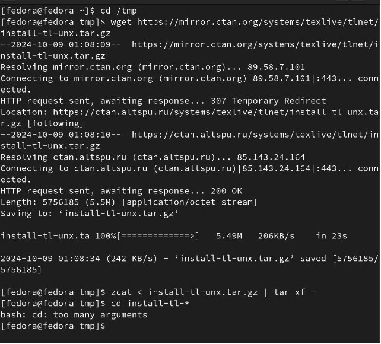{#fig:001 width=70%}

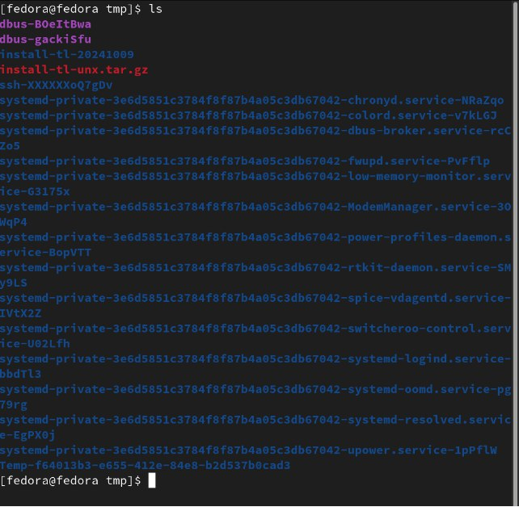{#fig:002 width=70%}

вместо команды perl ./install-tl использовалась команда sudo perl ./install-tl, так как при использовании первой происходил сбой установки.

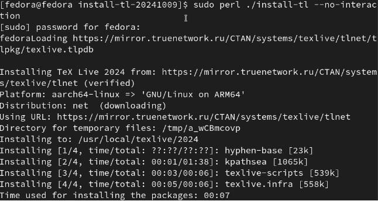{#fig:003 width=70%}

Добавил /usr/local/texlive/2024/bin/x86_64-linux в свой PATH.

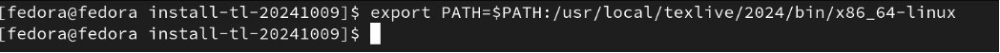{#fig:004 width=70%}

Я произвёл установку Pandoc и pandoc-crossref.

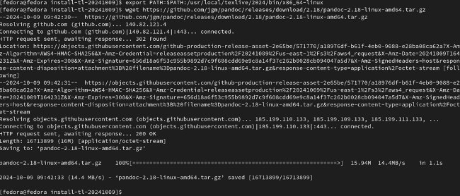{#fig:005 width=70%}

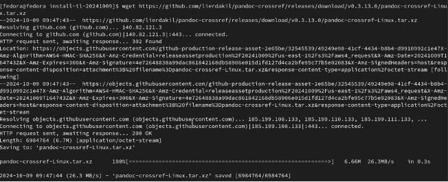{#fig:006 width=70%}

Распаковываю скачанные файлы

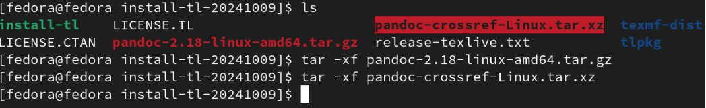{#fig:007 width=70%}

Копирую файлы pandoc и pandoc-crossref в каталог /usr/local/bin/.

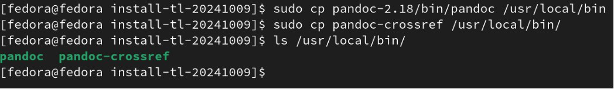{#fig:008 width=70%}

4.2 Заполнение отчета по выполнению лабораторной работы №3

Открываю терминал. Перехожу в каталог курса, сформированный при выпол-
неннии прошлой лаборатной работы, обновляю локальный репозиторий, скачав
изменения из удаленного репозитория с помощью команды git pull.

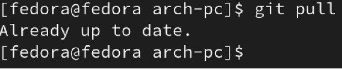{#fig:009 width=70%}

Перехожу в каталог с шаблоном отчета по лабораторной работе № 3, провожу
компиляцию шаблона с использованием Makefile. Для этого ввожу команду make.

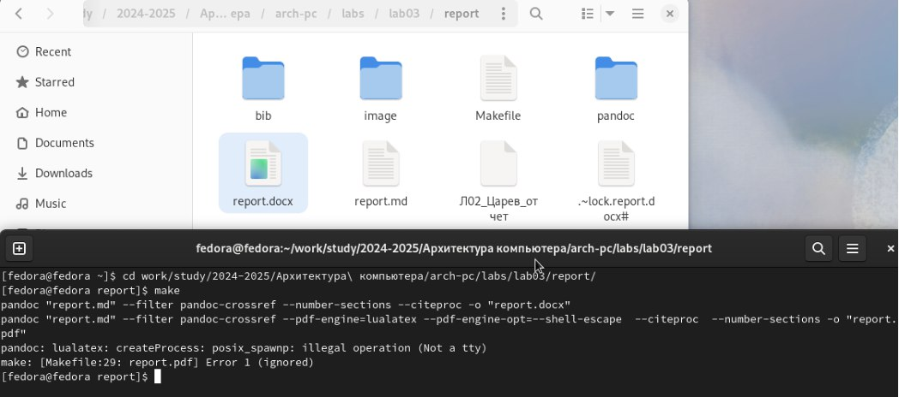{#fig:010 width=70%}

Убедился что всё правильно сгенерировалось

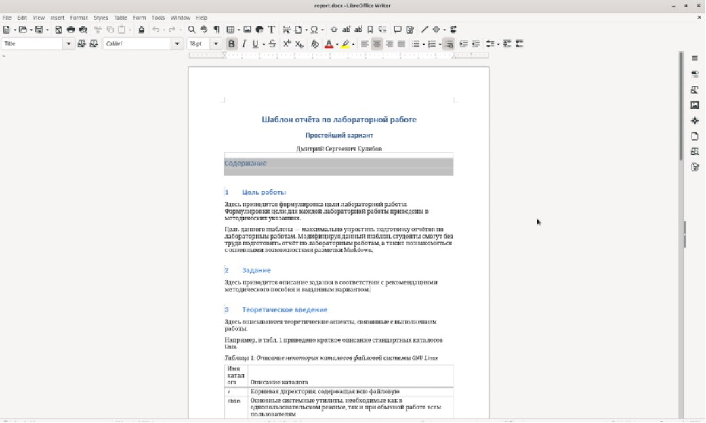{#fig:011 width=70%}

Удаляю полученные файлы с использованием Makefile, вводя команду make clean. С помощью команды ls проверяю, удалились ли созданные файлы.

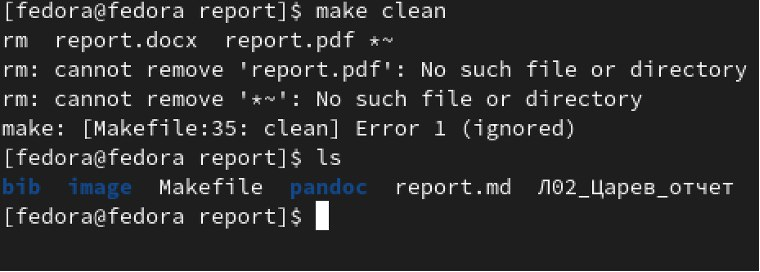{#fig:012 width=70%}

Открываю файл report.md.

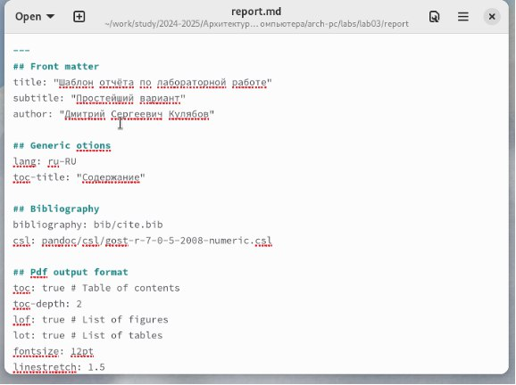{#fig:013 width=70%}

И начинаю заполнять отчет.

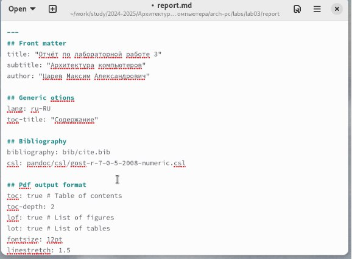{#fig:014 width=70%}

Компилирую файл с отчетом. Загружаю отчет на GitHub.

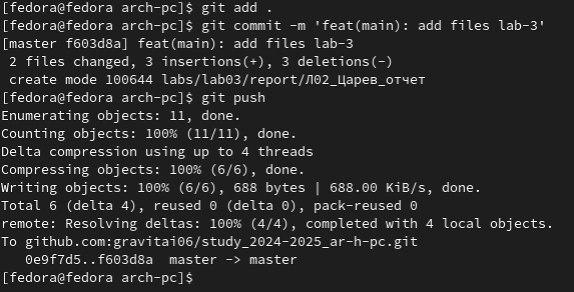{#fig:015 width=70%}

Задания для самостоятельной работы.

Перехожу в директорию lab02/report с помощью cd, чтобы там заполнять отчет,
копирую файл report.md с новым именем для заполненния отчета.

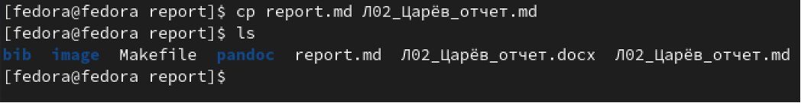{#fig:016 width=70%}

Заполняю отчет по лабораторной работе №2 при помощи языка разметки
Markdown.

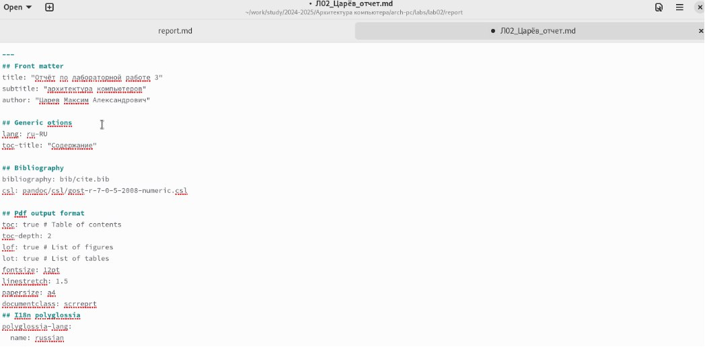{#fig:017 width=70%}

компилирую файл с отчетом по лабораторной работе,проверяю наличие фай-
лов.

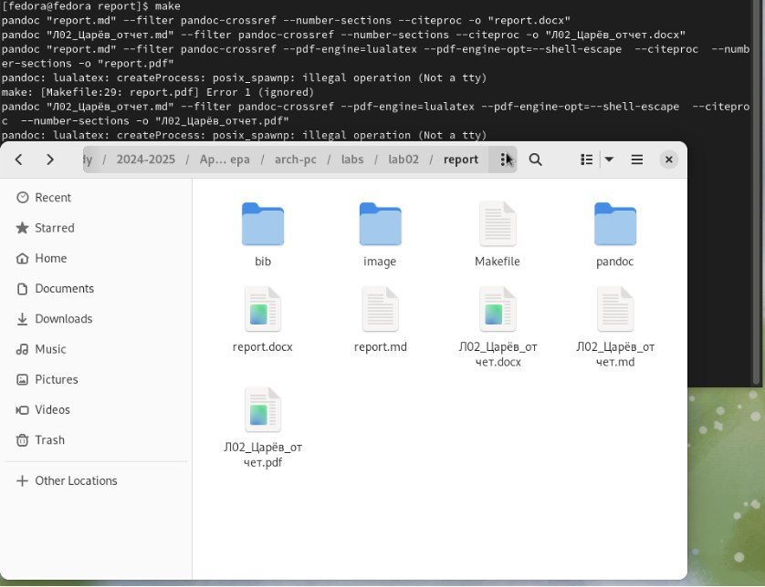{#fig:018 width=70%}

Отправил файлы на GitHub.

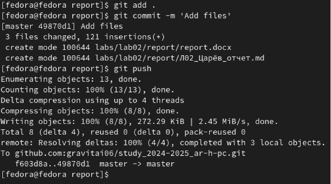{#fig:019 width=70%}

# Выводы

В результате выполнения данной лабораторной работы я освоил процедуры
оформления отчетов с помощью легковесного языка разметки Markdown.

