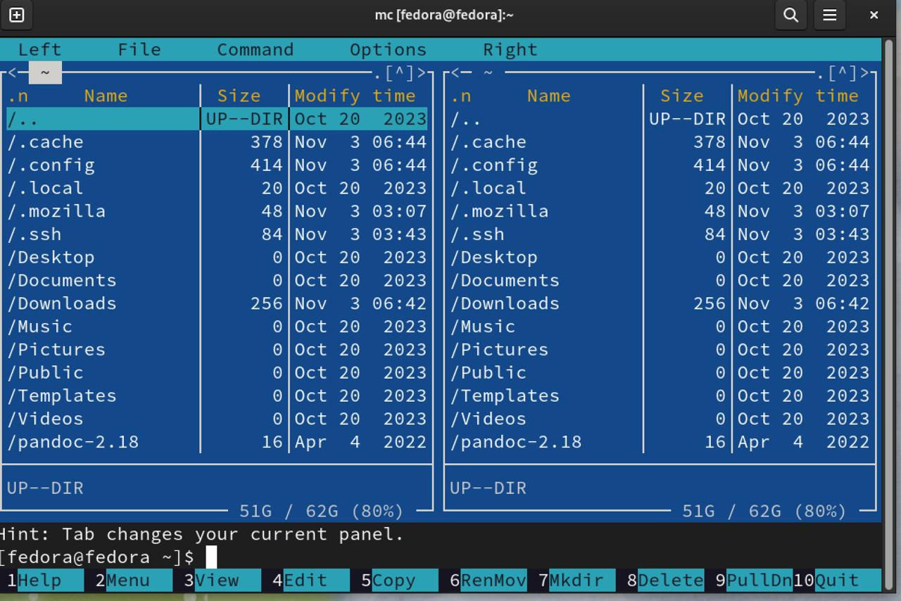
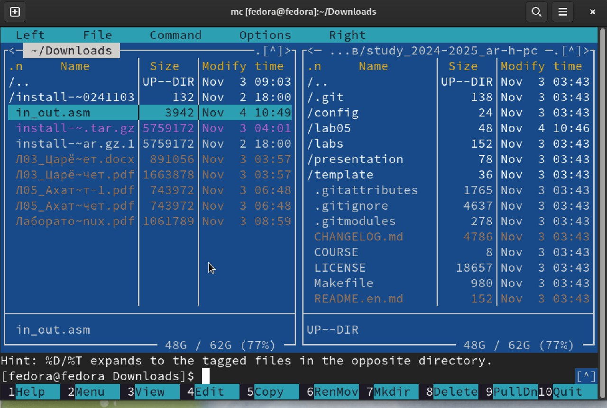

---
## Front matter
title: "Отчет по лабораторной работе №5"
subtitle: "Дисциплина: архитектура компьютера"
author: "Царёв Максим Александрович"

## Generic otions
lang: ru-RU
toc-title: "Содержание"

## Bibliography
bibliography: bib/cite.bib
csl: pandoc/csl/gost-r-7-0-5-2008-numeric.csl

## Pdf output format
toc: true # Table of contents
toc-depth: 2
lof: true # List of figures
lot: true # List of tables
fontsize: 12pt
linestretch: 1.5
papersize: a4
documentclass: scrreprt
## I18n polyglossia
polyglossia-lang:
  name: russian
  options:
	- spelling=modern
	- babelshorthands=true
polyglossia-otherlangs:
  name: english
## I18n babel
babel-lang: russian
babel-otherlangs: english
## Fonts
mainfont: IBM Plex Serif
romanfont: IBM Plex Serif
sansfont: IBM Plex Sans
monofont: IBM Plex Mono
mathfont: STIX Two Math
mainfontoptions: Ligatures=Common,Ligatures=TeX,Scale=0.94
romanfontoptions: Ligatures=Common,Ligatures=TeX,Scale=0.94
sansfontoptions: Ligatures=Common,Ligatures=TeX,Scale=MatchLowercase,Scale=0.94
monofontoptions: Scale=MatchLowercase,Scale=0.94,FakeStretch=0.9
mathfontoptions:
## Biblatex
biblatex: true
biblio-style: "gost-numeric"
biblatexoptions:
  - parentracker=true
  - backend=biber
  - hyperref=auto
  - language=auto
  - autolang=other*
  - citestyle=gost-numeric
## Pandoc-crossref LaTeX customization
figureTitle: "Рис."
tableTitle: "Таблица"
listingTitle: "Листинг"
lofTitle: "Список иллюстраций"
lotTitle: "Список таблиц"
lolTitle: "Листинги"
## Misc options
indent: true
header-includes:
  - \usepackage{indentfirst}
  - \usepackage{float} # keep figures where there are in the text
  - \floatplacement{figure}{H} # keep figures where there are in the text
---

# Цель работы

Целью данной лабораторной работы является приобретение практических навыков работы в Midnight Commander, освоение инструкций языка ассемблера mov и int.

# Теоретическое введение

Midnight Commander (или просто mc) — это программа, которая позволяет просматривать структуру каталогов и выполнять основные операции по управлению файловой системой, т.е. mc является файловым менеджером. Midnight Commander позволяет сделать работу с файлами более удобной и наглядной.
Программа на языке ассемблера NASM, как правило, состоит из трёх секций: секция кода программы (SECTION .text), секция инициированных (известных во время компиляции) данных (SECTION .data) и секция неинициализированных данных (тех, под которые во время компиляции только отводится память, а значение присваивается в ходе выполнения программы) (SECTION .bss).
Для объявления инициированных данных в секции .data используются директивы DB, DW, DD, DQ и DT, которые резервируют память и указывают, какие значения должны храниться в этой памяти:
- DB (define byte) — определяет переменную размером в 1 байт;
- DW (define word) — определяет переменную размеров в 2 байта (слово);
- DD (define double word) — определяет переменную размером в 4 байта (двойное слово);
- DQ (define quad word) — определяет переменную размером в 8 байт (учетве-
рённое слово);
- DT (define ten bytes) — определяет переменную размером в 10 байт. Директивы используются для объявления простых переменных и для объявления массивов. Для определения строк принято использовать директиву DB в связи с особенностями хранения данных в оперативной памяти.
Инструкция языка ассемблера mov предназначена для дублирования данных источника в приёмнике. 
```NASM
mov dst,src
```
Здесь операнд dst — приёмник, а src — источник.
В качестве операнда могут выступать регистры (register), ячейки памяти (memory) и непосредственные значения (const).
Инструкция языка ассемблера intпредназначена для вызова прерывания с
указанным номером. 
```NASM
int n
```
Здесь n — номер прерывания, принадлежащий диапазону 0–255. При программировании в Linux с использованием вызовов ядра sys_calls n=80h (принято задавать в шестнадцатеричной системе счисления).

# Задание

Открываю Midnight Commander, введя в терминал mc

{ #fig:001 width=70% }

Перехожу в каталог ~/work/study/2023-2024/Архитектура Компьютера/arch-pc

{ #fig:002 width=70% }

С помощью клавиши F7 создаю каталог lab05

{ #fig:003 width=70% }

Перехожу в созданный каталог,в строке ввода прописываю команду touch lab05-
1.asm, чтобы создать файл

{ #fig:004 width=70% }

4.2 Структура программы на языке ассемблера NASM
Превращаю текст программы для вывода “Hello world!” в объектный код с помо-
щью транслятора NASM, используя команду nasm -f elf hello.asm, ключ -f указыва-
ет транслятору nasm, что требуется создать бинарный файл в формате ELF (рис.
4.5). Далее проверяю правильность выполнения команды с помощью утилиты ls:
действительно, создан файл “hello.o”

4.3 Работа с расширенным синтаксисом командной
строки NASM
С помощью функциональной клавиши F4 открываю файл lab5-1.asm для ре-
дактирования во встроенном редакторе.
Ввожу в файл код программы для запроса строки у пользователя

{ #fig:005 width=70% }

выхожу из файла (Ctrl+X), сохраняя изменения (Y, Enter). Открыл файл и убе-
дился,что файл содержит текст программы. Транслирую текст программы файла
в объектный файл командой nasm -f elf lab5-1.asm.Создался объектный файл
lab5-1.o. Выполняю компоновку объектного файла с помощью команды ld -m
elf_i386 -o lab5-1 lab5-1.o. Создался исполняемый файл lab5-1.

{ #fig:006 width=70% }

{ #fig:007 width=70% }

Запускаю исполняемый файл. Программа выводит строку “Введите строку:”
и ждет ввода с клавиатуры, я ввожу свои ФИО, на этом программа заканчивает
свою работу


##Подключение внешнего файла
Скачиваю файл in_out.asm со страницы курса в ТУИС.

{ #fig:008 width=70% }

Копирую файл in_out.asm из каталога Загрузки в созданный каталог lab05
С помощью функциональной клавиши F5 копирую файл lab5-1 в тот же каталог,
но с другим именем, для этого в появившемся окне mc прописываю имя для
копии файла

{ #fig:009 width=70% }

Изменяю содержимое файла lab5-2.asm во встроенном редакторе nano, чтобы
в программе использовались подпрограммы из внешнего файла in_out.asm.

{ #fig:010 width=70% }

Открываю файл lab5-2.asm для редактирования в nano. Изменяю в нем подпро-
грамму sprintLF на sprint. Сохраняю изменения и открываю файл для просмотра,
чтобы проверить сохранение действий

{ #fig:011 width=70% }

Открываю файл lab5-2.asm для редактирования в nano. Изменяю в нем подпро-
грамму sprintLF на sprint. Сохраняю изменения и открываю файл для просмотра,
чтобы проверить сохранение действий

{ #fig:012 width=70% }

Снова транслирую файл, выполняю компоновку созданного объектного файла,
запускаю новый исполняемый файл

{ #fig:013 width=70% }


Разница между первым исполняемым файлом и вторым в том, что запуск пер-
вого запрашивает ввод с новой строки, а программа, которая исполняется при
запуске второго, запрашивает ввод без переноса на новую строку, потому что в
этом заключается различие между подпрограммами sprintLF и sprint.
#Выполнение заданий для самостоятельной работы
Создаю копию файла lab5-1.asm с именем lab5-1-1.asm. открываю созданный
файл для редактирования. Изменяю программу так, чтобы кроме вывода при-
глашения и запроса ввода, она выводила вводимую пользователем строку.

{ #fig:014 width=70% }

Создаю объектный файл lab5-1-1.o, отдаю его на обработку компоновщику, по-
лучаю исполняемый файл lab5-1-1, запускаю полученный исполняемый файл.
Программа запрашивает ввод, ввожу свои ФИО, далее программа выводит вве-
денные мною данные

{ #fig:015 width=70% }

Создаю копию файла lab5-2.asm с именем lab5-2-1.asm

{ #fig:016 width=70% }

Открываю созданный файл для редактирования. Изменяю программу так,
чтобы кроме вывода приглашения и запроса ввода, она выводила вводимую
пользователем строку

{ #fig:017 width=70% }

Создаю объектный файл lab5-2-1.o, отдаю его на обработку компоновщику,
получаю исполняемый файл lab5-2-1, запускаю полученный исполняемый файл.
Программа запрашивает ввод без переноса на новую строку, ввожу свои ФИО,
далее программа выводит введенные мною данные


# Выводы

При выполнении данной лабораторной работы я приобрел практические навы-
ки работы в Midnight Commander, а также освоил инструкции языка ассемблера
mov и int.
