---
## Front matter
title: "Отчет по лабораторной работе №7"
subtitle: "Дисциплина архитектура компьютера"
author: "Царёв Максим Александрович"

## Generic otions
lang: ru-RU
toc-title: "Содержание"

## Bibliography
bibliography: bib/cite.bib
csl: pandoc/csl/gost-r-7-0-5-2008-numeric.csl

## Pdf output format
toc: true # Table of contents
toc-depth: 2
lof: true # List of figures
lot: true # List of tables
fontsize: 12pt
linestretch: 1.5
papersize: a4
documentclass: scrreprt
## I18n polyglossia
polyglossia-lang:
  name: russian
  options:
	- spelling=modern
	- babelshorthands=true
polyglossia-otherlangs:
  name: english
## I18n babel
babel-lang: russian
babel-otherlangs: english
## Fonts
mainfont: IBM Plex Serif
romanfont: IBM Plex Serif
sansfont: IBM Plex Sans
monofont: IBM Plex Mono
mathfont: STIX Two Math
mainfontoptions: Ligatures=Common,Ligatures=TeX,Scale=0.94
romanfontoptions: Ligatures=Common,Ligatures=TeX,Scale=0.94
sansfontoptions: Ligatures=Common,Ligatures=TeX,Scale=MatchLowercase,Scale=0.94
monofontoptions: Scale=MatchLowercase,Scale=0.94,FakeStretch=0.9
mathfontoptions:
## Biblatex
biblatex: true
biblio-style: "gost-numeric"
biblatexoptions:
  - parentracker=true
  - backend=biber
  - hyperref=auto
  - language=auto
  - autolang=other*
  - citestyle=gost-numeric
## Pandoc-crossref LaTeX customization
figureTitle: "Рис."
tableTitle: "Таблица"
listingTitle: "Листинг"
lofTitle: "Список иллюстраций"
lotTitle: "Список таблиц"
lolTitle: "Листинги"
## Misc options
indent: true
header-includes:
  - \usepackage{indentfirst}
  - \usepackage{float} # keep figures where there are in the text
  - \floatplacement{figure}{H} # keep figures where there are in the text
---

# Цель работы

Изучение команд условного и безусловного переходов. Приобретение навыков написания
программ с использованием переходов. Знакомство с назначением и структурой файла
листинга.

# Задание

1. Программа с использованием инструкции jmp(листинг 1)
2. Программа с использованием инструкции jmp(листинг 2)
3. Изучение структуры файла листинга
4. Выполнение заданий для самостоятельной работы

# Теоретическое введение

Для реализации ветвлений в ассемблере используются так называемые ко-
манды передачи управления или команды перехода. Можно выделить 2 типа
переходов:
• условный переход – выполнение или не выполнение перехода в определен-
ную точку программы в зависимости от проверки условия.
• безусловный переход – выполнение передачи управления в определенную
точку программы без каких-либо условий.
   
Безусловный переход выполняется инструкцией jmp (от англ. jump – прыжок),
которая включает в себя адрес перехода, куда следует передать управление:
mp <адрес_перехода>
Адрес перехода может быть либо меткой, либо адресом области памяти, в
которую предварительно помещен указатель перехода. Кроме того, в качестве
операнда можно использовать имя регистра, в таком случае переход будет осу-
ществляться по адресу, хранящемуся в этом регистре.

| Тип операнда | Описание |
|--------------|----------------------------------------------------------------------------------------------------------------------------|
| `jmp label`  | Переход на метку labe |
| `mp [label]` | Переход по адресу в памяти, помеченному меткой label |
| `jmp eax`    | Переход по адресу из регистра eax |

В следующем примере рассмотрим использование инструкции jmp:

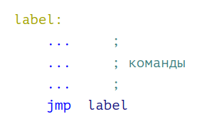{ #fig:001 width=70% }

Команды условного перехода__

Как отмечалось выше, для условного перехода необходима проверка какого-
либо условия. В ассемблере команды условного перехода вычисляют условие
перехода анализируя флаги из регистра флагов.

Регистр флагов

Флаг – это бит, принимающий значение 1 («флаг установлен»), если выпол-
нено некоторое условие, и значение 0 («флаг сброшен») в противном случае.
Флаги работают независимо друг от друга, и лишь для удобства они помещены в
единый регистр — регистр флагов, отражающий текущее состояние процессора.
В следующей таблице указано положение битовых флагов в регистре флагов:

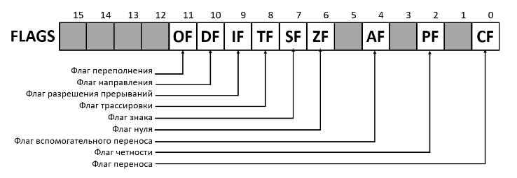{ #fig:002 width=70% }

Флаги состояния (биты 0, 2, 4, 6, 7 и 11) отражают результат выполнения
арифметических инструкций, таких как ADD, SUB, MUL, DIV.

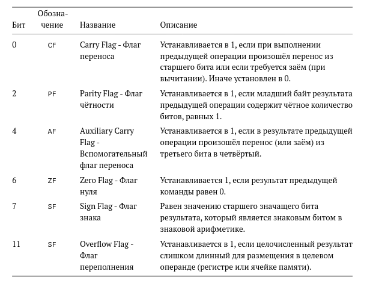{ #fig:003  width=70% }

Описание инструкции cmp

Инструкция cmp является одной из инструкций, которая позволяет сравнить
операнды и выставляет флаги в зависимости от результата сравнения.
Инструкция cmp является командой сравнения двух операндов и имеет такой
же формат, как и команда вычитания:
cmp <операнд_1>, <операнд_2>
Команда cmp, так же как и команда вычитания, выполняет вычитание
<операнд_2> - <операнд_1>, но результат вычитания никуда не записывается
и единственным результатом команды сравнения является формирование
флагов.
Примеры:
{ #fig:004 width=70% }

Описание команд условного перехода

Команда условного перехода имеет вид
j<мнемоника перехода> label
Мнемоника перехода связана со значением анализируемых флагов или со
способом формирования этих флагов.
В табл. 8.3. представлены команды условного перехода, которые обычно ста-
вятся после команды сравнения cmp. В их мнемокодах указывается тот резуль-
тат сравнения, при котором надо делать переход. Мнемоники, идентичные по
своему действию, написаны в таблице через дробь (например, ja и jnbe). Про-
граммист выбирает, какую из них применить, чтобы получить более простой
для понимания текст программы.

Инструкции условной передачи управления по результатам
арифметического сравнения cmp a,b

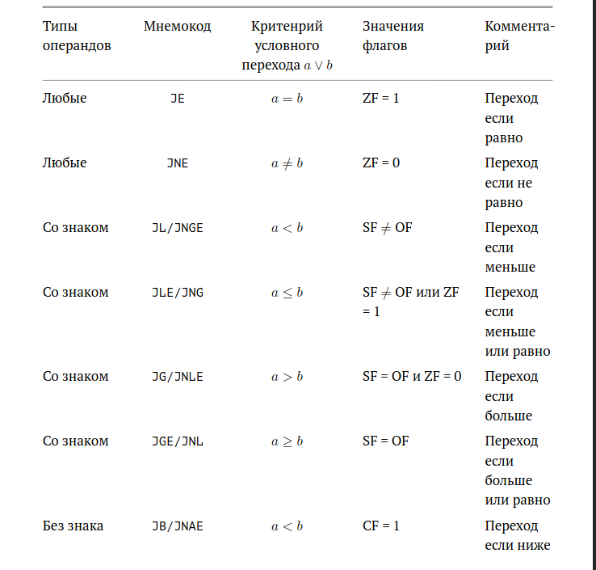{ #fig:005 width=70% }

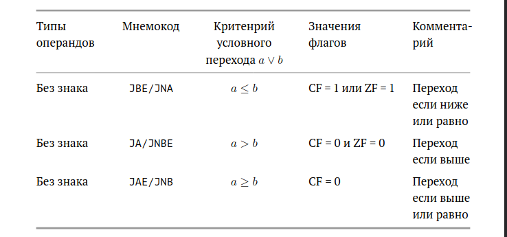{ #fig:006 width=70% }

Примечание: термины «выше» («a» от англ. «above») и «ниже» («b» от англ.
«below») применимы для сравнения беззнаковых величин (адресов), а термины
«больше» («g» от англ. «greater») и «меньше» («l» от англ. «lower») используются
при учёте знака числа. Таким образом, мнемонику инструкции JA/JNBE можно
расшифровать как «jump if above (переход если выше) / jump if not below equal
(переход если не меньше или равно)».
Помимо перечисленных команд условного перехода существуют те, которые
которые можно использовать после любых команд, меняющих значения флагов.

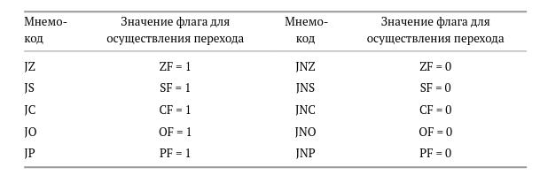{ #fig:007 width=70% }

В качестве примера рассмотрим фрагмент программы, которая выполняет
умножение переменных a и b и если произведение превосходит размер байта,
передает управление на метку Error.
mov al, a
mov bl, b
mul bl
jc Error

Файл листинга и его структура

Листинг (в рамках понятийного аппарата NASM) — это один из выходных фай-
лов, создаваемых транслятором. Он имеет текстовый вид и нужен при отладке
программы, так как кроме строк самой программы он содержит дополнитель-
ную информацию.
Ниже приведён фрагмент файла листинга.

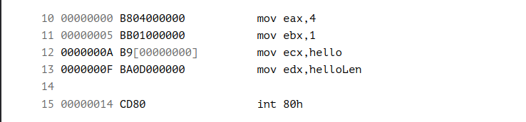{ #fig:008 width=70% }

Строки в первой части листинга имеют следующую структуру

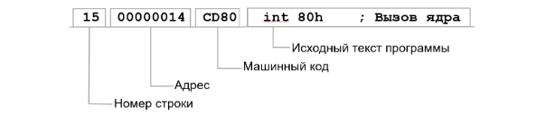{ #fig:009 width=70% }

Все ошибки и предупреждения, обнаруженные при ассемблировании, транслятор выводит
на экран, и файл листинга не создаётся.
Итак, структура листинга:
• номер строки — это номер строки файла листинга (нужно помнить, что номер строки в
файле листинга может не соответствовать номеру строки в файле с исходным текстом
программы);
• адрес — это смещение машинного кода от начала текущего сегмента;
• машинный код представляет собой ассемблированную исходную строку в виде шестна-
дцатеричной последовательности. (например, инструкция int 80h начинается по сме-
щению 00000020 в сегменте кода; далее идёт машинный код, в который ассемблируется
инструкция, то есть инструкция int 80h ассемблируется в CD80 (в шестнадцатеричном
представлении); CD80 — это инструкция на машинном языке, вызывающая прерывание
ядра);

# Выполнение лабораторной работы

## Реализация переходов в NASM

создал каталог lab07 для программам лабораторной работы,
перешёл в него и создал файл lab7-1.asm 

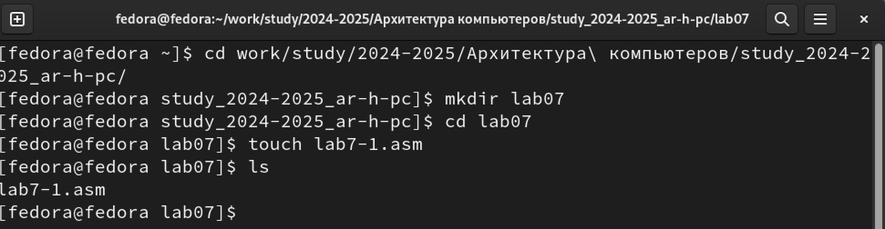{ #fig:009 width=70% }

## Программа с использованием инструкции jmp

я скопировал внешний файл в созданный ката-
лог, ввёл текст программы с использованием инструкции jmp в текстовый файл
lab7-1.asm, создал объектный файл и проверил работу программы

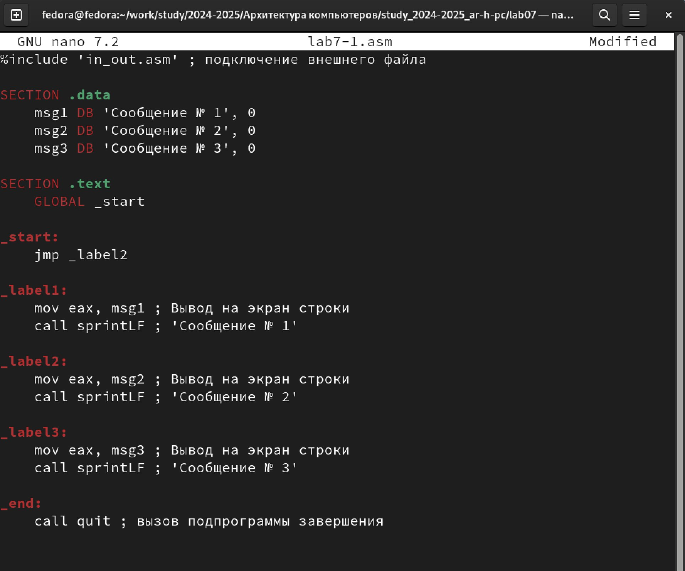{ #fig:010 width=70% }

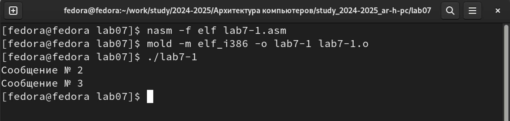{ #fig:011 width=70% }

изменил текст программы и проверил её работу

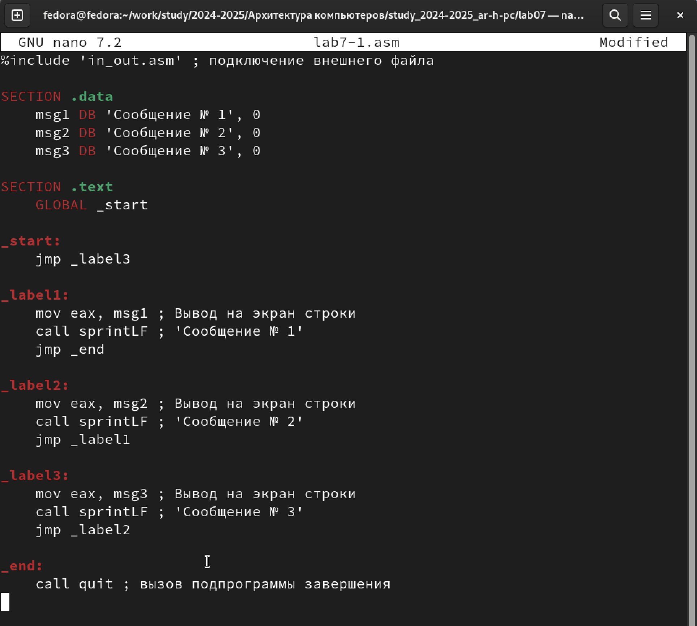{ #fig:012 width=70% }

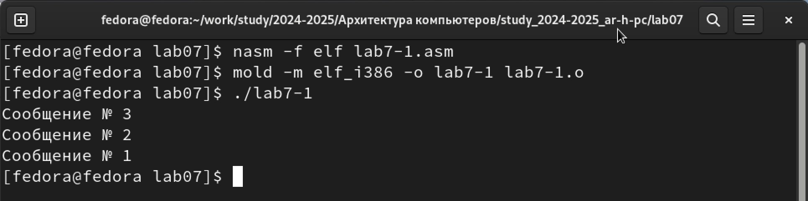{ #fig:013 width=70% }

Программа, которая определяет и выводит на экран наибольшую из 3 целочисленных переменных: A,B и C.
Создаю файл с названием lab7-2.asm и ввожу текст программы.

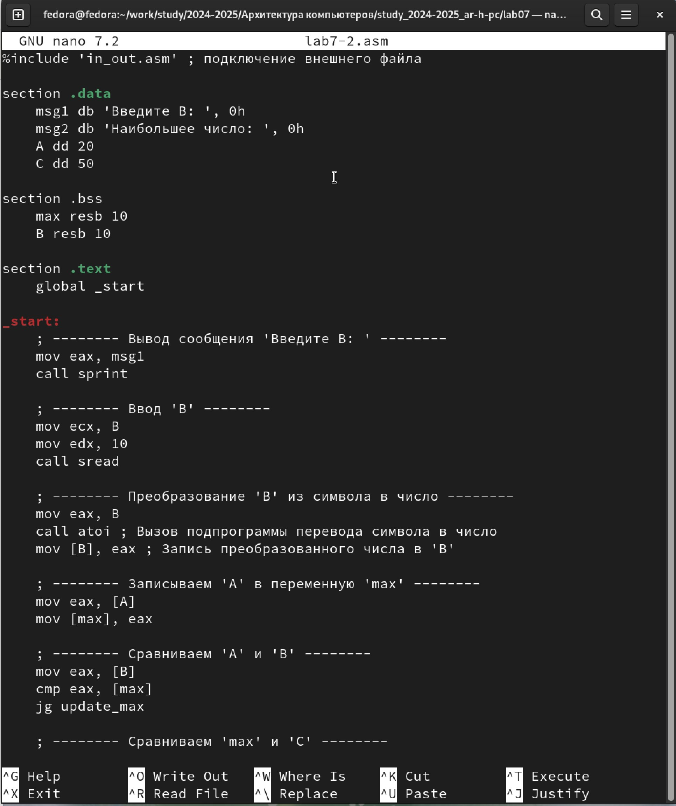{ #fig:014 width=70% }

При введении числа до 50, программа выводит наибольшее число 50, при введении числа больше 50, программа выводит введенное нами число. Программа сравнивает число A (значение 20) и C (значение 50) и инициализирует переменную max значением большего из них. Сравнивает текущее значение max с введённым числом B и обновляет max, если B больше. Выводит сообщение “Наибольшее число:” и затем значение переменной max, которая содержит наибольшее из трёх чисел: A, B и C

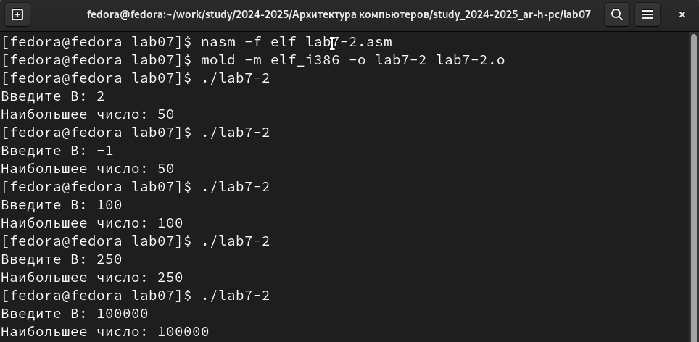{ #fig:015 width=70% }

## Изучение структуры файлы листинга

Создаю файл листинга для программы из файла

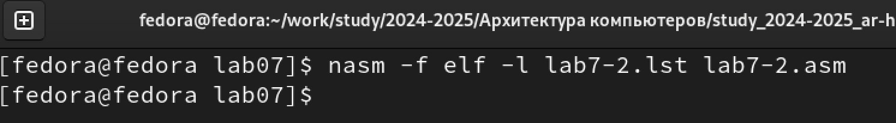{ #fig:016 width=70% }

Открываю его через mcedit

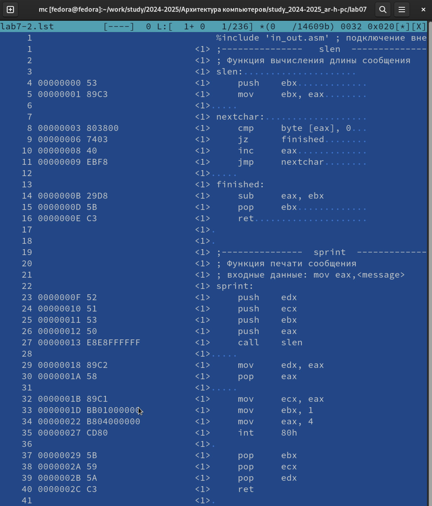{ #fig:017 width=70% }

При компиляции и сборке программы на ассемблере создаются следующие файлы:
Объектный файл (.o): Это промежуточный файл, содержащий машинный код, но ещё не готовый для выполнения. 
Исполняемый файл: После связывания объектных файлов с библиотеками (например, с помощью ld), создается исполняемый файл, который можно запустить.
Файл листинга (.lst): Это текстовый файл, который включает исходный код программы вместе с адресами и скомпилированным машинным кодом. В этом файле обычно содержатся комментарии и информация о процессе компиляции.

В файл листинга могут быть добавлены следующие элементы:
Исходный код: Полный исходный код программы, как он написан в ассемблере.
Адреса: Для каждой инструкции будут указаны адреса в памяти, по которым эти инструкции будут располагаться после компиляции.
Машинный код: Бинарный код, соответствующий каждой инструкции, представленный в шестнадцатеричном формате.
Комментарии: Комментарии из исходного кода, которые могут помочь понять логику программы.
Информация о секциях: Данные о том, как разделены секции кода (.text, .data, .bss и т.д.) и их размеры.
Ошибки и предупреждения: Если при компиляции были обнаружены ошибки или предупреждения, они также могут быть записаны в файл листинга.

# Выполнение заданий для самостоятельной работы

Создаю файл с названием lab7-3.asm, написал программу для нахождения наименьшего из 3 переменных,значения переменных беру исходя из своего варианта, полученного в ходе лабораторной работы номер 6,номер моего варианта 12.

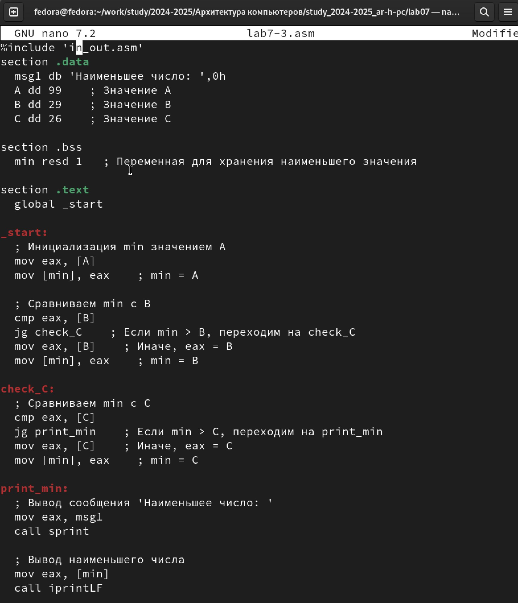{ #fig:018 width=70% }

Проверяю работу программы,программа работает верно.

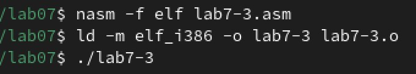{ #fig:019 width=70% }

{ #fig:020 width=70% }

Создаю файл с названием lab7-4.asm, написал программу для вычисления f(x),пишу программу для функции исходя из своего варианта, полученного в ходе лабораторной работы номер 6,номер моего варианта 12.

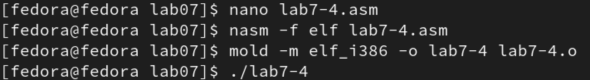{ #fig:021 width=70% }

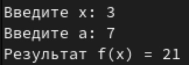{ #fig:022 width=70% }

Программа работает верно,это я выяснил подставив значения.

# Выводы

В результате выполнения данной лабораторной работы, я изучил команды
условного и безусловного переходов, приобрел навыки написания программ с
использованием переходов и познакомился с назначением и структурой файла
листинга

